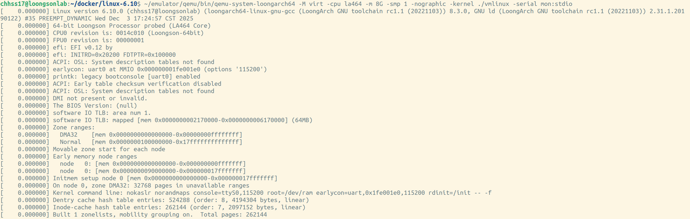
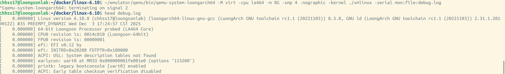
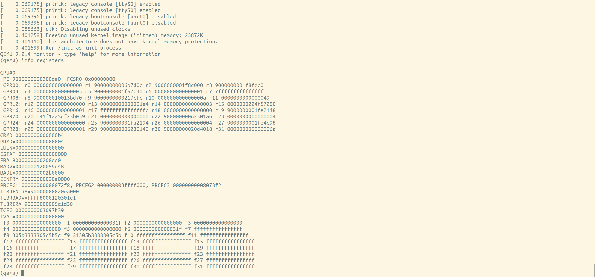
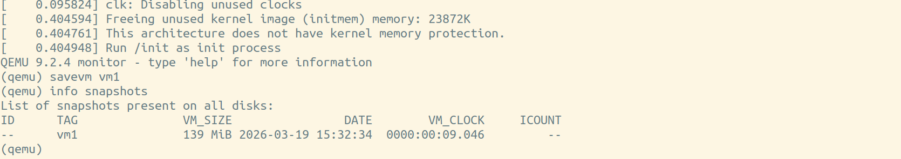
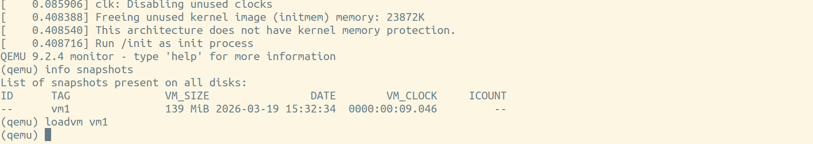
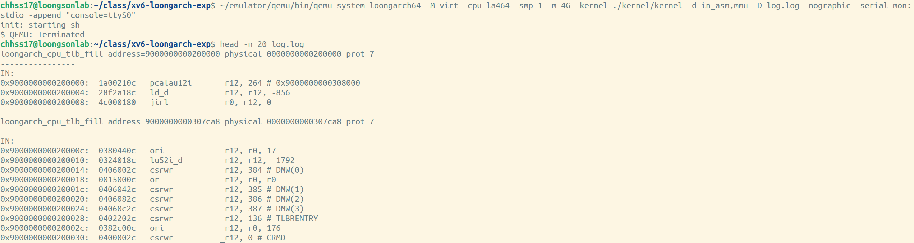

# LoongArch最小debug环境搭建

## 制作 Linux RamDisk

请参考文档第一章，安装 QEMU 。

请参考文档第一章，编译 Linux Kernel 。

使用以下命令，在 QEMU 中启动 Linux Kernel。
``` bash
#	replace your real path with {/path/to/qemu}.
{/path/to/qemu}/bin/qemu-system-loongarch64 -M virt -cpu la464 -m 8G -smp 1 -nographic -kernel ./vmlinux -serial mon:stdio
```
运行结果如下所示:


## QEMU 参数说明

QEMU 常用的启动参数，如下所示:

1. 设备类型: -machine/-M

在qemu中，不同的指令集的模拟器会编译成不同的可执行文件，可以运行在不同的平台上，可使用 -machine/-M 指定模拟器运行的设备信息。
```shell
$ qemu -M ?

Supported machines are:
none                 empty machine
virt                 Loongson-3A5000 LS7A1000 machine (default)

```
2. 内存大小: -m

参数-m 1G就是指定虚拟机内部的内存大小为1GB，使用说明如下:

```shell
$ qemu -m ?

qemu-system-loongarch64: -m ?: Parameter 'size' expects a non-negative number below 2^64
Optional suffix k, M, G, T, P or E means kilo-, mega-, giga-, tera-, peta-
and exabytes, respectively.
```

3. 核心数: -smp

现代cpu往往是对称多核心的，因此通过添加启动参数 -smp 8 可以指定虚拟机核心数为 8。

```shell
$ qemu -smp ?

smp-opts options:
  books=<num>
  clusters=<num>
  cores=<num>
  cpus=<num>
  dies=<num>
  drawers=<num>
  maxcpus=<num>
  sockets=<num>
  threads=<num>
```

4. 关闭图像输出: -nographic

参数关闭了图像输出模式，QEMU 运行时不再弹出新窗口，信息输入输出，通过 serial 串口，在终端显示交互。

5. 串口输出重定向: -serial

-serial 选项用于配置 QEMU 中虚拟机的串行端口（UART），将串行端口重定向到宿主机指定的字符设备（char dev），如标准输入/输出（终端）、TCP端口、文件等。

该参数决定了虚拟机串口的数据“从哪里来，到哪里去”，在调试嵌入式系统和操作系统启动过程中非常有用。

-serial 的基本用法是 -serial dev，其中的 dev 代表你要重定向到的目标设备。

在启动 Linux 时，常见用法为 -serial mon:stdio。该选项表示将 QEMU 的监视器（monitor）和虚拟机串口复用，一起重定位到QEMU进程的标准输入输出(终端)。

6. 调试参数: -s -S

参数选项用于建立 gdb 服务。

其中，-s 选项会让 QEMU 在 TCP 端口 1234 监听来自 gdb 的传入连接，-S 选项会使 QEMU 在启动后，不立即运行 guest ，而是等待主机 gdb 发起连接。

7. 指定镜像: -kernel

熟悉上述参数后，可在 QEMU 时添加对应参数，进入调试模式。

首先需要在启动 Linux Kernel 时加入额外参数。

参数指定传入 QEMU 的内核的镜像文件，一般是ELF文化，也可以是uImage等。

``` bash
#	replace your real path with {/path/to/qemu}.
{/path/to/qemu}/bin/qemu-system-loongarch64 -M virt -cpu la464 -m 4G -smp 1 -nographic -kernel ./vmlinux -serial mon:stdio -S -s
```

打开一个新终端，并在终端中运行以下命令:

``` bash
gdb ./vmlinux
```

进入 gdb 程序后，使用以下命令，与 QEMU 进行连接。
``` bash
(gdb)target remote localhost:1234
```

:::{note}
端口 1234 是 QEMU 默认的 gdb 连接端口，特殊情况下，当该端口不可用时，可使用 -gdb tcp::xxxx 来代替 QEMU 启动参数 -s ，其中 xxxx 代表可使用的新端口。

同时，在 gdb 启动时候，使用 target remote localhost:xxxx 来与 QEMU 建立连接，同样，xxxx 代表可使用的新端口，并与 QEMU 启动时配置的新端口相同。
:::

## QEMU 调试教程

### 串口输出重定向

通过 -serial 参数，将虚拟机的调试信息，通过串口进行输出，并在宿主机上重定向到指定设备。

可使用 -serial mon:stdio 到当前终端。

也可将调试信息保存到指定文件。

可通过如下命令:

``` bash
# replace your real path with {/path/to/qemu}.
# replace your filename with 'debug.log'
{/path/to/qemu}/bin/qemu-system-loongarch64 -M virt -cpu la464 -m 8G -smp 1 -nographic -kernel ./vmlinux -serial mon:file:debug.log
```

在当前文件下，会生成 debug.log 文件(或指定名字的文件)。查看文件，可得到调试信息(查看调试信息文件之前，需要通过 Ctrl + C 结束 QEMU 进程)。

运行结果如下所示:


### GDB 调试

可查看文档 8.2 章 -- GDB 使用

### QEMU Monitor

QEMU内部有一个管理控制台，提供了一套命令来动态查询和修改虚拟机状态，而无需重启虚拟机。

默认情况下，可以通过 Ctrl+Alt+2 组合键在图形界面中切换到Monitor。在无图形界面中，可通过 -monitor stdio 将其重定向到当前终端，也可以与串口复用：-serial mon:stdio，此时可通过特定转义键（如Ctrl+a c）在串口和Monitor之间切换。

在 Monitor 状态下，可以使用一些命令，查看虚拟机状态，进行调试。

调试类命令，与 GDB 模式相同。如可使用 info 命令查询虚拟机状态信息，运行如下所示:



控制类命令，则支持 qemu 的快照功能。

QEMU 的快照功能是将虚拟机在虚拟机在某个时间点上的，磁盘信息、内存信息，进行备份，以便在需要时可以快速恢复到该状态。该功能常用于内核模块编译、修改和测试等场景。

保存快照时，首先使用以下命令，创建一个 qcow2 格式的磁盘镜像(raw格式不支持快照):
``` bash
# replace your real path with {/path/to/qemu}.
{/path/to/qemu}/bin/qemu-img create -f qcow2 save.qcow2 10G
```
系统启动参数，修改为如下命令:
``` bash
# replace your real path with {/path/to/qemu}.
{/path/to/qemu}/bin/qemu-system-loongarch64 -M virt -cpu la464 -m 8G -smp 1 -nographic -kernel ./vmlinux -serial mon:stdio -drive file=save.qcow2,format=qcow2
```
运行结果如下所示:



加载快照，可使用以下命令，运行结果如下所示:



### 日志工具

QEMU 中使用 -d 和 -D 参数配合使用是调试操作系统非常有效的方法，可以记录详细的内部调试信息，帮助开发者分析操作系统的行为、定位问题。

-d 参数用于启用调试信息的打印，后面可以跟一个或多个调试信息类型，用逗号分隔。

常见调试信息类型包括：
- in_asm：记录汇编指令执行
- exec：记录指令执行
- int：记录中断信息
- mmu：记录内存管理单元(MMU)操作
- cpu：记录CPU操作
- mem：记录内存访问

-D 参数用于指定调试日志文件的路径，将调试信息输出到指定文件中，而不是显示在终端上。

在编译小型操作系统时，两个参数可配合使用，运行结果如下所示:



可以获取内核完全启动前的信息，方便调试。

### 常见问题

1. GDB 无法连接 QEMU

检查 QEMU 是否使用了 -S 和 -gdb 参数；确保端口未被占用。

2. 内核启动信息不显示

确认使用了-nographic和-serial mon:stdio参数；检查内核参数中是否设置了console=ttyS0；检查 QEMU 配置内存大小是否满足操作系统要求；检查操作系统串口基址是否和 QEMU 设备匹配。

3. GDB无法加载调试符号

确保编译内核时启用了CONFIG_DEBUG_INFO。

4. QEMU 启动失败

常见检查顺序：[检查启动命令] --> [路径是否正确] --> [内存/CPU是否合理] --> [镜像文件是否损坏] --> [资源是否超限] --> [使用qemu-img修复] --> [调整资源配置] --> [检查系统环境] --> [KVM是否加载] --> [权限是否足够] --> [modprobe kvm] --> [使用sudo执行] --> [启用调试日志]
