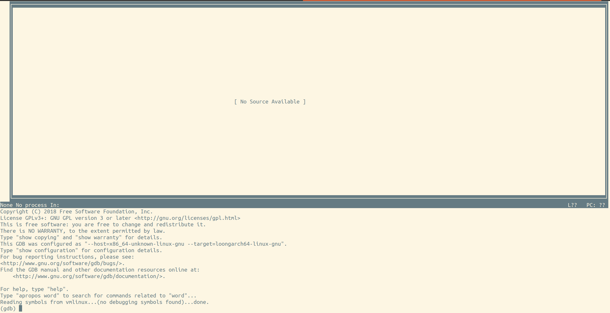

# GDB使用

## 交叉编译环境中的GDB

在 x86 环境下配置 LoongArch 架构 QEMU，可参考文档第一章。

在 x86 环境下配置交叉编译器，可参考文档第一章。

编译好操作系统后，可使用以下命令，启动 QEMU :

``` bash
#	replace your real path with {/path/to/qemu}.
{/path/to/qemu}/bin/qemu-system-loongarch64 -M virt -cpu la464 -m 4G -smp 1 -nographic -kernel ./vmlinux -serial mon:stdio
```
可使用以下命令，进入 gdb 调试模式:

``` bash
#	replace your real path with {/path/to/qemu}.
{/path/to/qemu}/bin/qemu-system-loongarch64 -M virt -cpu la464 -m 4G -smp 1 -nographic -kernel ./vmlinux -serial mon:stdio -s -S 
```

交叉编译器的 gdb 与 QEMU 连接， 使用以下命令:
``` bash
loongarch64-unknown-linux-gnu-gdb ./vmlinux
```

gdb 内部命令，与原生 LoongArch 上 QEMU 连接 gdb 命令保持一致。

退出 gdb 模式，可在终端使用以下命令:
``` bash
quit
#	or
exit
```
也可以使用快捷键 Ctrl-d，即可退出 gdb 模式。

:::{tip}
gdb 启动后，会显示许多提示信息，如下所示。
``` bash
$ loongarch64-unknown-linux-gnu-gdb
GNU gdb (GDB) 15.1
Copyright (C) 2024 Free Software Foundation, Inc.
License GPLv3+: GNU GPL version 3 or later <http://gnu.org/licenses/gpl.html>
This is free software: you are free to change and redistribute it.
There is NO WARRANTY, to the extent permitted by law.
Type "show copying" and "show warranty" for details.
This GDB was configured as "--host=x86_64-unknown-linux-gnu --target=loongarch64-unknown-linux-gnu".
Type "show configuration" for configuration details.
For bug reporting instructions, please see:
<https://www.gnu.org/software/gdb/bugs/>.
Find the GDB manual and other documentation resources online at:
    <http://www.gnu.org/software/gdb/documentation/>.

For help, type "help".
(gdb) 
```
如果想关闭这样的提示信息，可使用 -q 选项，将其关闭:
``` bash
$ loongarch64-unknown-linux-gnu-gdb -q
(gdb)
```
同样，gdb 退出时，会有提示:
``` bash
A debugging session is active.
Inferior 1 [process xxxxx] will be killed.
Quit anyway? (y or n) y
Detaching from program: kernel, process 1
Ending remote debugging.
```
如果想关闭这样的提示信息,可在 gdb 中使用如下命令把提示信息关掉:
``` bash
(gdb) set confirm off
```
:::

## 常见的GDB命令示例

### 设置与管理断点

1. 设置断点

可使用 “break” 命令，或使用简写 “b” 。断点位置由函数名，虚拟地址，文件行号等信息确定。

在 gdb 界面，使用以下:
``` shell
#	replace _start with all function name which you need
(gdb)b _start
#	or input any va 
(gdb)b *0x9000000000200000
#	or line number in file
(gdb)b file.c:6
```
输入命令，使 QEMU 开始运行 guest :
``` shell
(gdb)continue
```
当 PC 运行到断点对应函数、或对应地址，QEMU 将暂停运行。

2. 断点的管理。

可使用以下命令，查询已设置的断点。
``` shell
(gdb) info breakpoint
Num     Type           Disp Enb Address            What
1       breakpoint     keep y   0x900000000020006c in main at kernel/main.c:16
	breakpoint already hit 1 time
```
使用以下命令，可以保存已设置的断点。
``` bash
(gdb)save breakpoint file-name-to-save
```
下次调试时，可以使用以下命令，批量设置保存的断点。
``` bash
(gdb)save source file-name-to-save
```
使用以下命令，可以删除已设置的断点。
``` shell
(gdb) delete breakpoints 1
(gdb) info breakpoint     
No breakpoints, watchpoints, tracepoints, or catchpoints.
```
3. 设置临时断点。

如果想让断点只生效一次，可以使用命令 “tbreak” 或 “tb”。

以下方代码为例，进行说明。
``` C
#include <stdio.h>
#include <pthread.h>
typedef struct
{
	int a;
	int b;
	int c;
	int d;
	pthread_mutex_t mutex;
}ex_st;

int main(void) {
	ex_st st = {1, 2, 3, 4, PTHREAD_MUTEX_INITIALIZER};
	printf("%d,%d,%d,%d\n", st.a, st.b, st.c, st.d);
	return 0;
}
```
调试时在文件的第15行设置临时断点，当程序断住后，用“i b”（"info breakpoints"缩写）命令查看断点，发现断点没有了。也就是断点命中一次后，就被删掉了。
``` bash
(gdb) tb a.c:15
Temporary breakpoint 1 at 0x400500: file a.c, line 15.
(gdb) i b
Num 	Type 		Disp Enb Address 			What
1 		breakpoint	del  y 	 0x0000000000400500 in main at a.c:15
(gdb) r
Starting program: /data2/home/nanxiao/a
Temporary breakpoint 1, main () at a.c:15
15 		printf("%d,%d,%d,%d\n", st.a, st.b, st.c, st.d);
(gdb) i b
No breakpoints or watchpoints.
```
4. 设置条件断点。

gdb 可以设置条件断点，即，只有在条件满足时，断点才会被出发。命令为 “break ... if cond”

以下方代码为例，进行说明。
``` C
#include <stdio.h>
int main(void)
{
	int i = 0;
	int sum = 0;
	for (i = 1; i <= 200; i++)
	{
		sum += i;
	}
	printf("%d\n", sum);
	return 0;
}
```
gdb 调试时，可设置变量 “i” 的值为 101 时触发。
``` bash
(gdb) start
Temporary breakpoint 1 at 0x4004cc: file a.c, line 5.
Starting program: /data2/home/nanxiao/a
Temporary breakpoint 1, main () at a.c:5
5 		int i = 0;
(gdb) b 10 if i==101
Breakpoint 2 at 0x4004e3: file a.c, line 10.
(gdb) r
Starting program: /data2/home/nanxiao/a
Breakpoint 2, main () at a.c:10
10
(gdb) p sum
$1 = 5050
```

### 设置与管理观察点

1. 设置观察点

gdb 可以设置观察点，即，当一个变量值发生变化时，程序会暂停运行。

可使用 “watch variable” 命令，为变量 variable 设置观察点，当 variable的值发生任意变化时，程序暂停，在 gdb 窗口中打印旧值与新值的信息。

也可以使用 “watch *(data type)*address" 方式，通过指定地址与数据类型/数据宽度的方式，达到设置观察点的目的。

### 打印变量

gdb 中，使用 “p variable” 命令，打印变量 variable 信息。

1. 普通变量

如果 variable 是一个普通变量，则会打印变量数值。

2. 数组

如果 variable 是一个数组，则会打印数据所有元素，缺省最多显示 200 个元素。

如果想要全部显示，可使用命令 “set print elements number-of-elements” 或 “set print elements 0” 进行配置，在使用 “p variable” 进行打印，则可显示数据全部元素。

如果要打印数组中任意连续元素的值，可以使用“ p variable”[index]@num” 命令。其中 index 是数组索引（从0开始计数）， num 是连续多少个元素。

3. 字符串

可以使用 “x/s variable” 命令打印 ASCII 字符串。

### 打印寄存器信息

可使用以下命令，打印寄存器信息:
``` shell
(gdb)info registers  # or: i r
(gdb) info registers 
r0             0x0                 0
r1             0x9000000000200058  0x9000000000200058 <spin>
r2             0x0                 0x0
r3             0x9000000000308d00  0x9000000000308d00 <stack0+4080>
r4             0x1000              4096
r5             0x1                 1
r6             0x200               512
r7             0x0                 0
r8             0x0                 0
r9             0x0                 0
r10            0x0                 0
r11            0x0                 0
r12            0x8                 8
r13            0x0                 0
r14            0x0                 0
r15            0x0                 0
r16            0x0                 0
r17            0x0                 0
r18            0x0                 0
r19            0x0                 0
r20            0x0                 0
r21            0x0                 0
r22            0x9000000000308d10  0x9000000000308d10 <uart_tx_lock>
r23            0x0                 0
r24            0x0                 0
r25            0x0                 0
r26            0x0                 0
r27            0x0                 0
r28            0x0                 0
r29            0x0                 0
r30            0x0                 0
r31            0x0                 0
orig_a0        0x0                 0
pc             0x900000000020006c  0x900000000020006c <main+16>
badv           0x0                 0x0

```
可指定寄存器，进行查询:
``` shell
(gdb) info registers r4
r4             0x1000              4096
```
### 查看内存数值

可使用以下命令，打印虚拟内存对应地址的数值:
``` shell
(gdb) print /x *0x90000000002016a4
$7 = 0x4c000020
```
### 查看堆栈信息

可使用以下命令，查看当前调用堆栈:
``` shell
(gdb) bt   
#0  initlock (lk=lk@entry=0x9000000000308d10 <uart_tx_lock>, name=name@entry=0x900000000020b018 "uart") at kernel/spinlock.c:14
#1  0x9000000000200158 in uartinit () at kernel/uart.c:77
#2  0x9000000000201f54 in consoleinit () at kernel/console.c:187
#3  0x90000000002000a0 in main () at kernel/main.c:17
```
可使用以下命令，切换到其他堆栈处。
``` shell
(gdb) frame 0
#0  initlock (lk=lk@entry=0x9000000000308d10 <uart_tx_lock>, name=name@entry=0x900000000020b018 "uart") at kernel/spinlock.c:14
14	  lk->name = name;
(gdb) frame 1
#1  0x9000000000200158 in uartinit () at kernel/uart.c:77
77	  initlock(&uart_tx_lock, "uart");
```
### 单步执行

gdb 模式下，使用 next 或 step 指令，均可实现程序单步执行。

- next 命令。如何当前行包含函数调用，next 命令会执行整个函数调用，然后停到函数调用后的下一行。该命令不会进入到函数内部，而是直接执行完函数。

- step 命令。如果当前行包含函数调用，step 会进入函数内部，开始调试函数内部的代码。该指令会逐行执行函数内部的指令。

### 设置变量数值

在 gdb 中，可使用命令 “set var variable=expr”，设置变量的值。其中，variable 为变量名称，expr为变量新的赋值。

以下方代码为例，进行说明。
``` C
#include <stdio.h>
int func(void)
{
	int i = 2;
	return i;
}
int main(void)
{
	int a = 0;
	a = func();
	printf("%d\n", a);
	return 0;
}
```
gdb 调试时，在特定位置设置断点，进行调试:
``` bash
Breakpoint 2, func () at a.c:5
5 		int i = 2;
(gdb) n
7 		return i;
(gdb) set var i = 8
(gdb) p i
$4 = 8
```

### 退出正在调试的函数

当单步调试一个函数时，如果不想继续跟踪下去，有两种方式实现退出。

以下方代码为例，进行说明。
``` C
#include <stdio.h>
int func(void)
{
	int i = 0;
	i += 2;
	i *= 10;
	return i;
}
int main(void)
{
	int a = 0;
	a = func();
	printf("%d\n", a);
	return 0;
}
```
方法一，使用 “finish” 命令，函数会继续执行完，并打印返回值。
``` bash
(gdb) n
17 		a = func();
(gdb) s
func () at a.c:5
5 		int i = 0;
(gdb) n
7 		i += 2;
(gdb) fin
find 	finish
(gdb) finish
Run till exit from #0 func () at a.c:7
0x00000978 in main () at a.c:17
17 		a = func();
Value returned is $1 = 20
```
方法二，使用 “return” 命令，函数不会继续执行下面的语句，而是直接返回。也可以用 “return expression”命令，指定函数的返回值。
``` bash
(gdb) n
17 		a = func();
(gdb) s
func () at a.c:5
5 		int i = 0;
(gdb) n
7 		i += 2;
(gdb) n
8 		i *= 10;
(gdb) return 40
Make func return now? (y or n) y
#0 0x00000978 in main () at a.c:17
17 		a = func();
(gdb) n
18 		printf("%d\n", a);
(gdb)
40
19 		return 0;
```

### 打印函数堆栈帧信息

gdb 调试时，可使用 “i frame” 或 “info frame” 命令，显示函数堆栈帧信息。

以下方代码为例，进行说明。

``` C
#include <stdio.h>
int func(int a, int b)
{
	int c = a * b;
	printf("c is %d\n", c);
}
int main(void)
{
	func(1, 2);
	return 0;
}
```
使用该命令，gdb 可以输出当前函数堆栈帧的地址，指令寄存器的值，局部变量地址及值等信息，可以对照当前寄存器的值和函数的汇编指令看一下。

``` console
Breakpoint 1, func (a=1, b=2) at a.c:5
5 		printf("c is %d\n", c);
(gdb) i frame
Stack level 0, frame at 0x7fffffffe590:
rip = 0x40054e in func (a.c:5); saved rip = 0x400577
called by frame at 0x7fffffffe5a0
source language c.
Arglist at 0x7fffffffe580, args: a=1, b=2
Locals at 0x7fffffffe580, Previous frame's sp is 0x7fffffffe590
Saved registers:
rbp at 0x7fffffffe580, rip at 0x7fffffffe588
(gdb)
```

### 配置 GDB 脚本

当gdb启动时，会读取 HOME 目录和当前目录下的的配置文件，执行里面的命令。这个文件通常为 “.gdbinit” 。

一些 gdb 常用配置，可以直接写到 .gdbinit 文件中。当 gdb 启动时，自动读取文件，进行设置，无需多次手动配置。

### 图形化界面

启动 gdb 时，可通过指定 “-tui” 参数，或在运行 gdb 过程中，使用 “Ctrl+x+a"组合键，进入图形化调试界面。

界面如下所示。



## 调试指令常见失效状况

- 单步调试，在执行 ertn 等特权指令后，guest 程序会连续运行，调试失效。
- 内存访问指令，在遇到页表切换会，容易失效。


